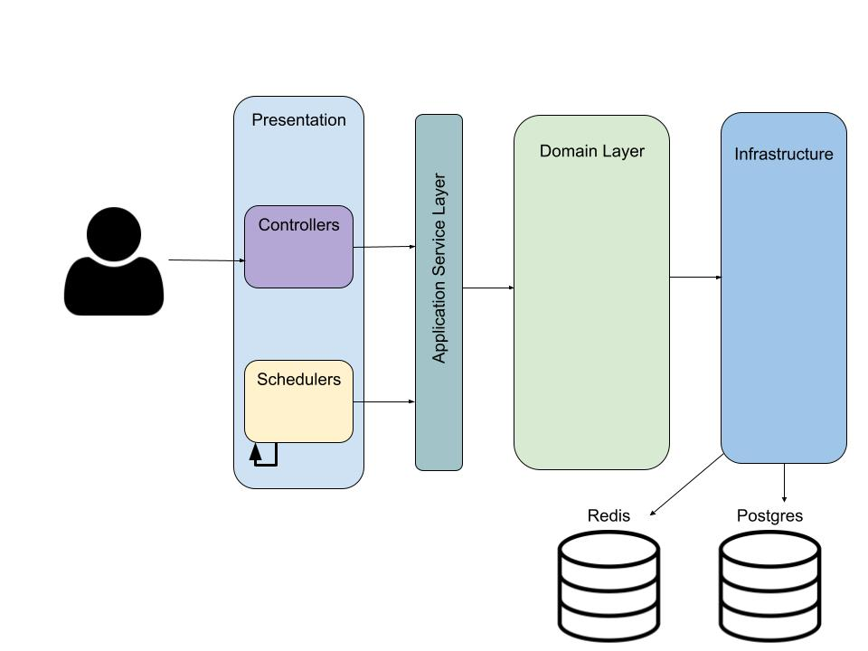

# Getting Started

## Build and run

For running this application there are the following options:

* Simple build and run using docker-compose
* Build and run using local tools:
    * Local java
    * Local gradle
    * Local Postgres
    * Local Redis

### Simple build and run with docker

This option uses maven image to compile and build the jar file then uses openJdk image to build a docker image.
All services (partner, postgres and application) are available through docker-compose

* Requirements:
    * docker ([Installation guide](https://docs.docker.com/engine/install))
    * docker-compose ([Installation guide](https://docs.docker.com/compose/install/))

* Build and run commands:
    * `docker-compose up`
* Advantages:
    * Easy to run
* Disadvantages:
    * Uses a lot of internet resources every time to download the dependencies

### Build and run using local tools

In this option the whole environment is local (Rather traditional environment)

* Requirements
    * java (17) jdk + jvm (for running the partner service)
    * Maven (installed locally)
    * Postgres database exposed on port 5432
    * Redis be running on port 6379
* Compile and test commands:
    * Simple jar generation: `gradle bootJar`
    * To run tests and generate jar: `gradle test bootJar`
    * You can also use the provided gradlew script(tested on linux): `./gradlew bootJar`
* Creating the database:
    * connect to postgres: `psql -U {user} -W postgres`
    * create database: `CREATE DATABASE orderanalyzer;`
    * create user: `create user orderanalyzer with password 'orderanalyzer';`
    * grant privileges: `grant all privileges on database orderanalyzer to orderanalyzer;`
* Initializing tables: This step is not required as hibernate will create the tables automatically.
* Run the application
    * `java -jar build/lib/order-quantity-analyzer-0.0.1-SNAPSHOT.jar -Dspring.profiles.active=local`

## Project Structure

The main structure of the project is based on the Domain Driven Design model:

* `presentation`: start point and entry point of services (Either from schedulers or controllers)
* `application`: represents ApplicationService layer which is in charge of delegating
  the responsibility to other services. Or controlling the flow
  (Also stops leakage of domainLayer models to presentation layer)
* `domain`: All business implementation and domain models of the application
* `infrustructure`: Contains of repositories or storage point or any external
  call an application would contain

